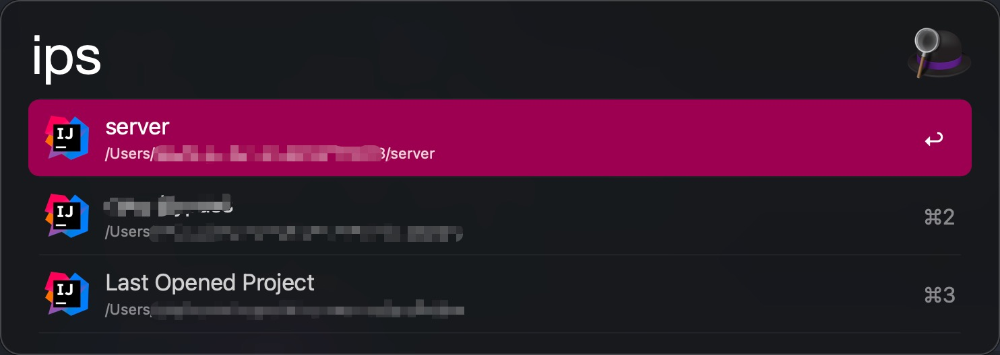
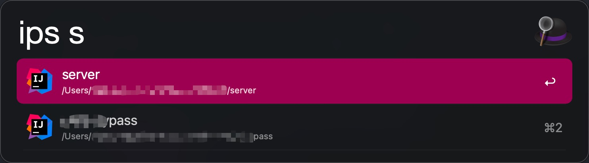

An Alfred workflow to list IntelliJ IDEA recent opened projects.

Requirements: Go and Alfred Powerpack.

The storage file of IDEA's recently opened project is 
```
$HOME/Library/Application Support/JetBrains/IntelliJIdea*/options/recentProjects.xml
```
this program will parse this file and output it in alfred.

Download the `ips.alfredworkflow` and import it to alfred



`ips ${name}` will search all projects to list projects whose name contains `${name}`



choose a project and press ↩, it will be opened by IDEA.

Only IntelliJ IDEA is supported now, if you need other JetBrains IDE's support, welcome issue :)
